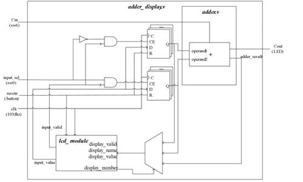
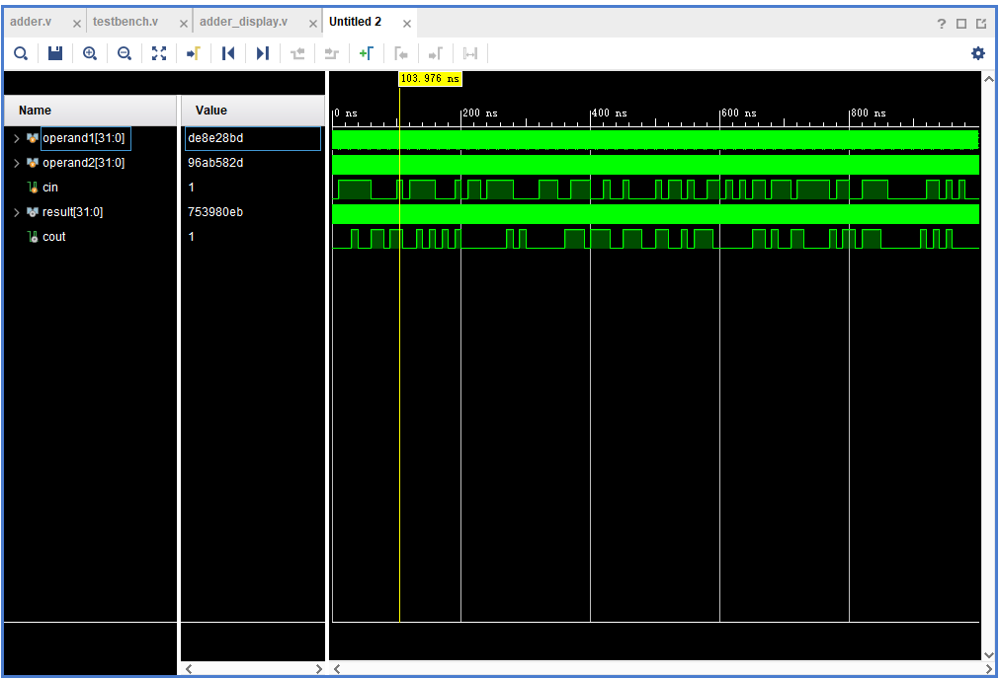
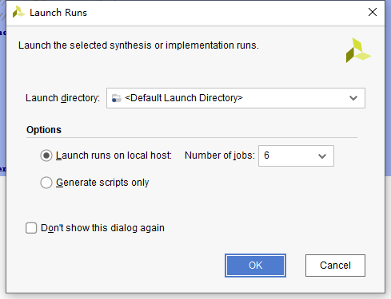
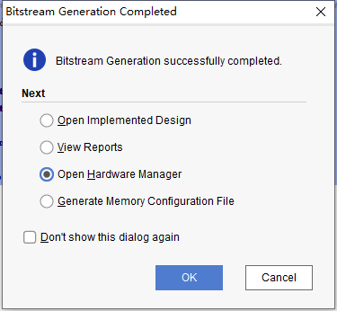
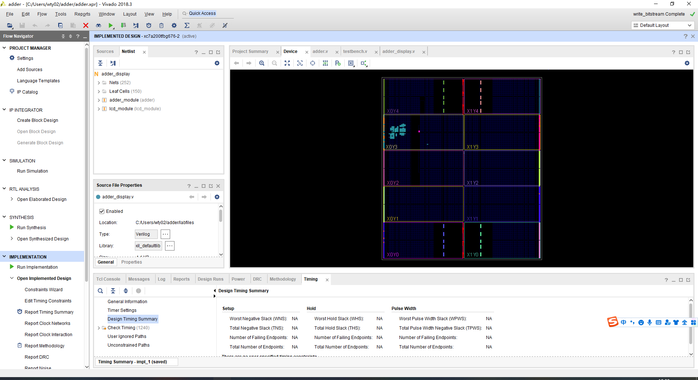

# 计算机组成原理实验1 加法器

**日期：2022年4月17日**

**组员：王天一、王天志**

## 一、实验目的

1. 熟悉 LS-CPU-EXB-002 实验箱和软件平台。 

2. 掌握利用该实验箱各项功能开发组成原理和体系结构实验的方法。

3. 理解并掌握加法器的原理和设计。 

4. 熟悉并运用 Verilog 语言进行电路设计。 
## 二、课设器材与设备

1. 装有 Xilinx Vivado 的计算机一台。 

2. LS-CPU-EXB-002 教学系统实验箱一套

## 三、课设分析与设计

### 1. 设计原理

本次实验的加法器设计使用加号，即调用内部模块加法器，在加法器外面再封装一个display模块，即display模块调用加法器模块，通过display模块的触摸屏输入接口为加法器提供加数，加法器的结果又可以通过触摸屏反映到显示屏上。

### 2. 端口设计

时钟信号clk，复位信号rset，用于选择输入的input_sel，进位输入信号cin，进位输出信号cout，以及控制触摸屏的相关接口。

### 3. 设计框图



## 四、实际实现

### 1. 实现代码

```verilog
`timescale 1ns / 1ps
//*************************************************************************
//   > 文件名: adder.v
//   > 描述  ：加法器，直接使用"+"，会自动调用库里的加法器
//   > 作者  : LOONGSON
//   > 日期  : 2016-04-14
//*************************************************************************
module adder(
    input  [31:0] operand1,
    input  [31:0] operand2,
    input         cin,
    output [31:0] result,
    output        cout
    );
    assign {cout,result} = operand1 + operand2 + cin;

endmodule
```

### 2. 仿真实现



### 3. 生成比特流和烧录

1. 生成比特流
   
2. 生成比特流成功
   
3. 综合成功图像
   
4. 连接FPGA设备

