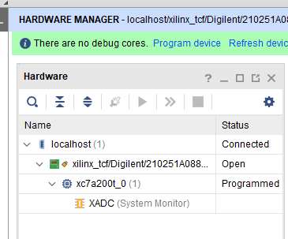

# 计算机组成原理实验1 定点加法器

**日期：2022年4月17日**

**王天一**

## 一、实验目的

1. 熟悉 LS-CPU-EXB-002 实验箱和软件平台。 

2. 掌握利用该实验箱各项功能开发组成原理和体系结构实验的方法。

3. 理解并掌握加法器的原理和设计。 

4. 熟悉并运用 Verilog 语言进行电路设计。 
## 二、课设器材与设备

1. 装有 Xilinx Vivado 的计算机一台。 

2. LS-CPU-EXB-002 教学系统实验箱一套

## 三、课设分析与设计

### 1. 设计原理

本次实验的加法器设计使用加号，即调用内部模块加法器，在加法器外面再封装一个display模块，即display模块调用加法器模块，通过display模块的触摸屏输入接口为加法器提供加数，加法器的结果又可以通过触摸屏反映到显示屏上。

### 2. 端口设计

时钟信号clk，复位信号rset，用于选择输入的input_sel，进位输入信号cin，进位输出信号cout，以及控制触摸屏的相关接口。

### 3. 设计框图


## 四、实际实现

### 1. 实现代码

```verilog
`timescale 1ns / 1ps
//*************************************************************************
//   > 文件名: adder.v
//   > 描述  ：加法器，直接使用"+"，会自动调用库里的加法器
//   > 作者  : LOONGSON
//   > 日期  : 2016-04-14
//*************************************************************************
module adder(
    input  [31:0] operand1,
    input  [31:0] operand2,
    input         cin,
    output [31:0] result,
    output        cout
    );
    assign {cout,result} = operand1 + operand2 + cin;

endmodule
```

### 2. 仿真实现


### 3. 生成比特流和烧录

1. 生成比特流
   

2. 生成比特流成功
   

3. 综合成功图像
   

4. 连接FPGA设备

   - 连接设备
     

   - 烧录
     
   - 烧录成功
     

5. 连接成功结果图

   - 加法功能测试
     
     
     

   - 进位指示灯测试
     

     

## 五、心得体会

经过本次实验我熟悉了实验板各器件的功能，各数据线的用途，熟悉了将比特流烧入实验板进而上板验证的操作流程，也学习到了触摸屏的基本功能原理以及使用方法，同时也进一步熟悉了vivado的使用，为以后的实验操作学习打下了基础。

## 六、附加问题

1. FPGA开发板上主要都有哪些功能部件，它们都有什么作用？它们分别在实验箱中的什么位置？
   

   如上图，开发板上的接口有：DC-IN用于提供直流电源，电源开关用于接通或断开开关；COM即串行通讯端口，多用于长距离的数据传输；VGA接口是电脑采用VGA标准输出数据的专业接口，LAN即用于路由器与局域网连接的接口；JTAG(Joint Test Action Group)是一种国际标准测试协议，主要用于芯片内部测试。现在多数的高级器件都支持JTAG协议，标准的JTAG接口是4线：TMS、TCK、TDI、TDO，分别为模式选择、时钟、数据输入和[数据输出](https://baike.baidu.com/item/数据输出/5885826)线；EJTAG(Enhanced Joint Test Action Group)是MIPS公司根据IEEE 1149．1协议的基本构造和功能扩展而制定的规范，是一个硬件/软件子系统，在处理器内部实现了一套基于硬件的调试特性，用于支持片上调试。此外还包括常用的USB接口，数模转换器AD/DA，扩展的IO口。

   双色LED灯、单色LED灯、点阵、LCD显示屏、数码管等用于输出数据的显示；存储部件有：SRAM，即静态随机存取存储器，但断电数据会丢失；NAND即闪存，断电后数据仍可以保存，且其功耗低；DDR即双倍速率同步[动态随机存储器](https://baike.baidu.com/item/动态随机存储器/8311483)，DDR是在SDRAM内存基础上发展而来，DDR是具有双倍数据传输速率的SDRAM，其传输速率是系统时钟频率的两倍；核心部件有：FPGA芯片；BIOS芯片，用于开机过程中各种硬件设备的初始化和检测的芯片。

   此外还包括4*4键盘、拨码开关用于手动调节一些输入信号的电平、复位键用于将输入数据置0、STEP按键等。

2. adder_display.v的结构是怎样的？怎么调用显示屏进行输入和输出？详细讲解有关程序流程。
   首先定义所有需要的输入输出接口，除了LCD触摸屏相关的接口，还需要定义用于选择输入数据的选择信号input_sel和输入进位信号sw_cin和输出led_cout，led_cout直接连接了加法器的进位结果；然后定义加法器需要的加数寄存器，用于存储两个加数，定义加法器的结果输出，然后调用加法器模块；接着定义触摸屏部分，根据信号display_name选择显示屏需要显示的数据，如数据名及对应的数值，本实验中可显示的数据名有ADD_1，ADD_2，RESUL，其他都显示空白；由于时钟信号为10MHz，变化极快，故看起来像是所有数据块的数据同时显示；在调用触摸屏输入数据后会更新input_value的值，并结合input_sel信号进一步更新加法器用到的加数寄存器，即实现了通过触摸屏更新加数的功能，又因为连接了加法器，加数变化时加法结果也变化，再结合display_name的选择即在屏幕上显示出新的加法结果。所有数据都是使用always同步触发更新的，由于调用了加法器与触摸屏，当输入数据改变时，触摸屏上显示的数值会随着加法器数据的改变而改变。

3. 整个加法器项目的结构如何，如何理解项目中各文件的作用？
   
   如上图，加法器与触摸屏的连接构成一个闭环，触摸屏选择需要显示的数据，并由触摸屏的输入改变加法器的加数输入，加法器的结果又反映在触摸屏上。文件结构如下：
   

   整个adder_display调用了加法器与lcd模块，adder.xdc文件为引脚绑定的约束文件，将顶层模块(本例中为 adder_display)的输入输出端口与 FPGA 板上的 IO 接口引脚绑定，以完成在板上的输入输出，AdderTestBench为测试文件，用于加法器功能的仿真验证。

4. 由于串行进位的设计使得直接32位的超前进位电路会很复杂，故采用先将4个4位超前进位加法器组合为16位加法器，再将2个16位加法器组合成32位的加法器，即得到32位的超前进位加法器。下面讲解4位的超前进位加法器原理：

   设Ai，Bi分别为两个加数第i位的数字，Ci，Ci+1分别是第i，i+1位的进位，则有Ci+1=(Ai*Bi) + (Ai+Bi)*Ci，设Gi=Ai*Bi，Pi=Ai+Bi，则Ci+1= Gi + Pi*Ci。有如下推导：

   

    

   即原理上只要输入A,B确定就可以推导出所有位的进位，为此我们需要用1位的全加器构造得到Pi与Gi信号，然后结合最低位的进位信号依次生成后面每一位的进位，进而再得到最终的加法结果，这样我们就得到了4位的超前进位加法器。让我们结合4个四位的超前进位加法器，每个加法器的输出我们都引出对应的Pi与Gi信号，这样我们可以把4个四位的加法器看作4个一位的加法器，按照前面的方式组合得到16位的加法器，再结合两个16位加法器即可得到32位的超前进位加法器。

   **代码实现**

   ```verilog
   `timescale 1ns / 1ps
   //////////////////////////////////////////////////////////////////////////////////
   // Company: 
   // Engineer: 
   // 
   // Create Date: 2022/04/24 17:47:01
   // Design Name: 
   // Module Name: adder_32bits
   // Project Name: 
   // Target Devices: 
   // Tool Versions: 
   // Description: 
   // 
   // Dependencies: 
   // 
   // Revision:
   // Revision 0.01 - File Created
   // Additional Comments:
   // 
   //////////////////////////////////////////////////////////////////////////////////
   
   
   module adder_1bit(X,Y,Cin,F,Cout);
   //一位加法器
    input X,Y,Cin;
     output F,Cout;
     assign F = X ^ Y ^ Cin;
     assign Cout = (X ^ Y) & Cin | X & Y;
   endmodule
   //4位CLA
   module CLA(c0,c1,c2,c3,c4,p1,p2,p3,p4,g1,g2,g3,g4);
      
   	 input c0,g1,g2,g3,g4,p1,p2,p3,p4;
   	 output c1,c2,c3,c4;
   	 
   	 assign c1 = g1 ^ (p1 & c0),
   	        c2 = g2 ^ (p2 & g1) ^ (p2 & p1 & c0),
   			c3 = g3 ^ (p3 & g2) ^ (p3 & p2 & g1) ^ (p3 & p2 & p1 & c0),
   			c4 = g4^(p4&g3)^(p4&p3&g2)^(p4&p3&p2&g1)^(p4&p3&p2&p1&c0);
   	 
   endmodule 
   
   //四位并行进位加法器
   module adder_4(x,y,c0,c4,F,Gm,Pm);
         input [4:1] x;
   	  input [4:1] y;
   	  input c0;
   	  output c4,Gm,Pm;
   	  output [4:1] F;
   	  	  
   	  wire p1,p2,p3,p4,g1,g2,g3,g4;
   	  wire c1,c2,c3;
   	  adder_1bit adder1(
   	             .X(x[1]),
   					 .Y(y[1]),
   					 .Cin(c0),
   					 .F(F[1]),
   					 .Cout()
   				);
   		
   	  adder_1bit adder2(
   	             .X(x[2]),
   					 .Y(y[2]),
   					 .Cin(c1),
   					 .F(F[2]),
   					 .Cout()
   				);	
   		
   	  adder_1bit adder3(
   	             .X(x[3]),
   					 .Y(y[3]),
   					 .Cin(c2),
   					 .F(F[3]),
   					 .Cout()
   				);
   			
   	  adder_1bit adder4(
   	             .X(x[4]),
   					 .Y(y[4]),
   					 .Cin(c3),
   					 .F(F[4]),
   					 .Cout()
   				);		
   		
   		CLA CLA(
   			.c0(c0),
   			.c1(c1),
   			.c2(c2),
   			.c3(c3),
   			.c4(c4),
   			.p1(p1),
   			.p2(p2),
   			.p3(p3),
   			.p4(p4),
   			.g1(g1),
   			.g2(g2),
   			.g3(g3),
   			.g4(g4)
   		);
   				
   		
   	  
     assign   p1 = x[1] ^ y[1],	  
              p2 = x[2] ^ y[2],
   		   p3 = x[3] ^ y[3],
   		   p4 = x[4] ^ y[4];
   
     assign   g1 = x[1] & y[1],
              g2 = x[2] & y[2],
   		   g3 = x[3] & y[3],
   		   g4 = x[4] & y[4];
   
     assign Pm = p1 & p2 & p3 & p4,
            Gm = g4 ^ (p4 & g3) ^ (p4 & p3 & g2) ^ (p4 & p3 & p2 & g1);
   
   endmodule 
   
   //16位CLA部件
   module CLA_16(A,B,c0,S,px,gx);
       input [16:1] A;
   	input [16:1] B;
   	input c0;
   	output gx,px;
   	output [16:1] S;
   	
   	wire c4,c8,c12;
   	wire Pm1,Gm1,Pm2,Gm2,Pm3,Gm3,Pm4,Gm4;
   	
   	adder_4 adder1(
   	     .x(A[4:1]),
   		  .y(B[4:1]),
   		  .c0(c0),
   		  .c4(),
   		  .F(S[4:1]),
   		  .Gm(Gm1),
   		  .Pm(Pm1)
   	);
   	
   	adder_4 adder2(
   	     .x(A[8:5]),
   		  .y(B[8:5]),
   		  .c0(c4),
   		  .c4(),
   		  .F(S[8:5]),
   		  .Gm(Gm2),
   		  .Pm(Pm2)
   	);
   	
       adder_4 adder3(
   	     .x(A[12:9]),
   		  .y(B[12:9]),
   		  .c0(c8),
   		  .c4(),
   		  .F(S[12:9]),
   		  .Gm(Gm3),
   		  .Pm(Pm3)
   	);
   
       adder_4 adder4(
   	     .x(A[16:13]),
   		  .y(B[16:13]),
   		  .c0(c12),
   		  .c4(),
   		  .F(S[16:13]),
   		  .Gm(Gm4),
   		  .Pm(Pm4)
   	);
   	
   	assign   c4 = Gm1 ^ (Pm1 & c0),
   	         c8 = Gm2 ^ (Pm2 & Gm1) ^ (Pm2 & Pm1 & c0),
   			 c12 = Gm3 ^ (Pm3 & Gm2) ^ (Pm3 & Pm2 & Gm1) ^ (Pm3 & Pm2 & Pm1 & c0);
    
       assign  px = Pm1 & Pm2 & Pm3 & Pm4,
   	        gx = Gm4 ^ (Pm4 & Gm3) ^ (Pm4 & Pm3 & Gm2) ^ (Pm4 & Pm3 & Pm2 & Gm1);
   	       
   endmodule 
   
   //32位并行进位加法器顶层模块
   module adder32(A,B,S,C32);
        input [32:1] A;
   	 input [32:1] B;
   	 output [32:1] S;
   	 output C32;
   	 
   	 wire px1,gx1,px2,gx2;
   	 wire c16;
   
     CLA_16 CLA1(
         .A(A[16:1]),
   		.B(B[16:1]),
   		.c0(0),
   		.S(S[16:1]),
   		.px(px1),
   		.gx(gx1)
   	);
     
     CLA_16 CLA2(
           .A(A[32:17]),
   		  .B(B[32:17]),
   		  .c0(c16),
   		  .S(S[32:17]),
   		  .px(px2),
   		  .gx(gx2)
   	);
   
     assign c16 = gx1 ^ (px1 && 0), //c0 = 0
            C32 = gx2 ^ (px2 && c16);
   
   endmodule 
   
   
   ```
