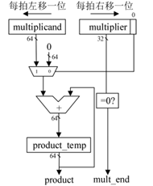
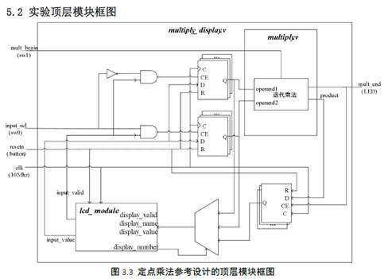
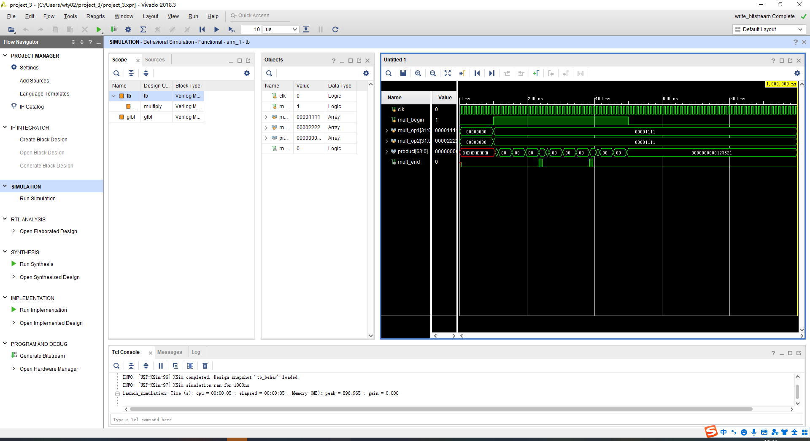
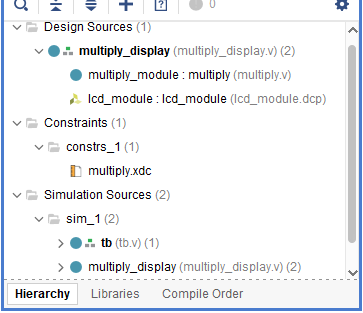
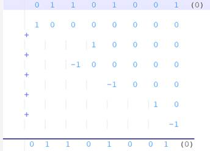

# 计算机组成原理实验2 定点乘法器

**日期：2022年5月8日**

**王天一 320200931301**

## 一、实验目的

1. 理解定点乘法的不同实现算法的原理，掌握基本实现算法。 

2. 熟悉并运用 Verilog 语言进行电路设计。 

3. 为后续设计 CPU的实验打下基础。

## 二、课设器材与设备

1. 装有 Xilinx Vivado 的计算机一台。 
2. LS-CPU-EXB-002 教学系统实验箱一套

## 三、课设分析与设计

1、课设原理

本例中设计的乘法部件实现的是迭代乘法算法，其原理图如下：



图中参与运算的为两个乘数的绝对值，乘法结果也是绝对值，需要单独判断符号位后校正乘积。

迭代乘法是在模拟我们人算乘法的过程，乘数每次右移一位，根据最低位，判断是加被乘数移位后的值还是加0，不停地累加最后就得到乘积了。

可以看到迭代乘法是用多次加法完成乘法操作的，故需要多拍时间，其结束标志为乘数移位后为0，故对于32 位乘法，最多需要32 拍才能完成一次乘法。

2、端口设计

时钟clk、复位resetn、输入选择信号input_sel，乘法开始信号mult_begin，高电平时乘法器开始工作，输出信号mult_end，高电平时表示乘法结束。在乘法器内部设置两个32位的乘数输入信号，以及64位的乘法结果输出信号product。

3、设计框图 
  

## 四、实际实现

### 1.实现代码

```verilog
module multiply(              // 乘法器
    input         clk,        // 时钟
    input         mult_begin, // 乘法开始信号
    input  [31:0] mult_op1,   // 乘法源操作数1
    input  [31:0] mult_op2,   // 乘法源操作数2
    output [63:0] product,    // 乘积
    output        mult_end    // 乘法结束信号
);

    //乘法正在运算信号和结束信号
    reg mult_valid;
    assign mult_end = mult_valid & ~(|multiplier); //乘法结束信号：乘数全0
    always @(posedge clk)
    begin
        if (!mult_begin || mult_end)
        begin
            mult_valid <= 1'b0;
        end
        else
        begin
            mult_valid <= 1'b1;
        end
    end

    //两个源操作取绝对值，正数的绝对值为其本身，负数的绝对值为取反加1
    wire        op1_sign;      //操作数1的符号位
    wire        op2_sign;      //操作数2的符号位
    wire [31:0] op1_absolute;  //操作数1的绝对值
    wire [31:0] op2_absolute;  //操作数2的绝对值
    assign op1_sign = mult_op1[31];
    assign op2_sign = mult_op2[31];
    assign op1_absolute = op1_sign ? (~mult_op1+1) : mult_op1;
    assign op2_absolute = op2_sign ? (~mult_op2+1) : mult_op2;

    //加载被乘数，运算时每次左移一位
    reg  [63:0] multiplicand;  //被乘数寄存器
    always @ (posedge clk)
    begin
        if (mult_valid)
        begin    // 如果正在进行乘法，则被乘数每时钟左移一位
            multiplicand <= {multiplicand[62:0],1'b0};
        end
        else if (mult_begin) 
        begin   // 乘法开始，加载被乘数，为乘数1的绝对值
            multiplicand <= {32'd0,op1_absolute};
        end
    end

    //加载乘数，运算时每次右移一位
    reg  [31:0] multiplier; //乘数寄存器
    always @ (posedge clk)
    begin
        if (mult_valid)
        begin   // 如果正在进行乘法，则乘数每时钟右移一位
            multiplier <= {1'b0,multiplier[31:1]}; 
        end
        else if (mult_begin)
        begin   // 乘法开始，加载乘数，为乘数2的绝对值
            multiplier <= op2_absolute; 
        end
    end
    
    // 部分积：乘数末位为1，由被乘数左移得到；乘数末位为0，部分积为0
    wire [63:0] partial_product; 
    assign partial_product = multiplier[0] ? multiplicand : 64'd0;
    
    //累加器
    reg [63:0] product_temp;
    always @ (posedge clk)
    begin
        if (mult_valid)
        begin
            product_temp <= product_temp + partial_product;
        end
        else if (mult_begin) 
        begin
            product_temp <= 64'd0;  // 乘法开始，乘积清零 
        end
    end 
     
    //乘法结果的符号位和乘法结果
    reg product_sign;
    always @ (posedge clk)  // 乘积
    begin
        if (mult_valid)
        begin
              product_sign <= op1_sign ^ op2_sign;
        end
    end 
    //若乘法结果为负数，则需要对结果取反+1
    assign product = product_sign ? (~product_temp+1) : product_temp;
endmodule
```

### 2.仿真及波形



## 五、测试图片


## 六、附加问题

### 1、为什么迭代乘法需要多次节拍才能实现一次乘法过程，对于32 位乘法，最多需要多少拍才能完成一次乘法？

由于只用一个寄存器保存每次被累加之后的结果，只能通过多次迭代累加，每一拍都将被乘数与乘数移一位，并累加加数，最终当乘数变为0才能得到乘法结果。32位乘法器最多需要32拍完成一次乘法。

###　２、请详细说明迭代乘法算法原理以及流程，以第一步、第二步这样的写法把步骤写清楚。

有符号乘法可以先经过无符号乘法运算获得乘积的绝对值，再结合两个乘数的符号决定是否需要将结果转为负数，这就要求需要将两个乘数根据补码规则先转为无符号数，最终结果再转为补码形式。累加器用于存放乘法的中间结果，最终它保存着乘法运算的结果。

第一步：保存两个乘数的符号，根据补码规则求得两个乘数的绝对值，设置两个乘数分别为各自的绝对值。此外累加器初始时设为0。

第二步：乘法信号有效时，设置被乘数每周期左移一位，乘数每周期右移一位。

第三步：根据乘数是否为0决定是否结束乘法运算，若是则结束运算，输出乘法结果；否则继续下一步。

第四步：根据目前乘数的最低位选择累加器是应该加被乘数还是加0，  

如果最低位是1则加被乘数，如果是0则加0。

第五步：根据之前保存的符号位，将乘法结果转为补码，返回第二步。

### 3、multiply_display.v的结构是怎样的？怎么调用显示屏进行输入和输出？如何理解整个乘法器项目中各文件作用？

multiply_display.v可以分为五部分：输入输出接口定义、乘法器模块调用、触摸屏模块调用、触摸屏输入选择、输出到触摸屏显示。调用乘法器时用寄存器保存乘数与积，用于调用触摸屏做乘数的输入赋值和后面触摸屏显示乘积。

调用触摸屏时先配置好接口，如display_valid、display_name、display_value、input_value等，在使用触摸屏时会产生输出input_value，然后根据选择输入信号input_sel，决定乘数还是被乘数会被赋于input_value的值，即完成了乘数的输入；乘法结束时，根据display_number使得显示乘积的那块区域会显示数据，此时将乘积赋值给该区域的display_value，该区域分为两块，每块各显示32位，并且设置其display_name为PRO_H和PRO_L，即低32位和高32位。

整个项目架构如下：



multiply_module提供乘法的具体实现，lcd_module为触摸屏实现部分，multiply_display调用了这两个模块multiply.xdc文件为引脚绑定的约束文件，将顶层模块的输入输出端口与 FPGA 板上的 IO 接口引脚绑定。tb.v为测试文件，用于验证乘法器的功能。

### 拓展题目 Booth算法

Booth算法原理：计算两个二进制数的乘法时，由于常规方法会产生很多部分积，相加很费时，我们可以将乘数做这样的拆分，如：

(1001)2 * (0111)2=(1001)2*(10000-1)2=(10010000)2-(1001)2

这样大大减少了部分积，这里只需要一次位移与减法就完成了乘法，Booth算法就是将乘法转为简单的位移操作与较少次数的减法操作。此时计算乘法的问题就在于，怎么样将一个乘数转为这里的(10000-1)2形式，观察乘数(0 1 1 0 1 0 0 1)2(我们在末尾补一个0)，可以拆为：

​     

我们从末尾附加的0开始向左看起，每次看两位，可以做下面的编码：

2’b00: 0

2’b01: 1

2’b10: -1

2’b11: 0

即对应了拆分的中间加数，由此我们再定义对于乘法的操作

2’b00: 无操作(0)

2’b01: 加被乘数(1)

2’b10: 减被乘数(-1)

2’b11: 无操作(0)

注意这里的被乘数要经过对应的左移再做加减。这样根据任意一个二进制串都可以做出相应的编码，以及决定移位之后是做加法还是减法。

具体实现思路：设A为被乘数，B为乘数，对于N位的乘法，我们需要一个2*N+1位的辅助数据P，初始化其值为0，在P[N:1]填充为乘数B，根据P[1:0]的值做上述定义的四类操作，注意每次加被乘数时要将被乘数左移N+1位，即与P的最高位对齐，得出结果后将P算数右移一位，再判断P[1:0]做上述操作，反复如此，直到P右移N次，最终得到的P[2*N+1:1]即为乘积结果。

具体代码实现时，可以在两个周期内完成对应的四类操作和移位，第一个周期只做四类操作之一，第二个周期进行移位，然后反复这两个周期，直到移位与数据宽度一样即表示乘法完成，代码如下：

```verilog
always @ ( posedge CLK or negedge RSTn )
begin
	if (!RSTn)
	begin
		i <= 0; //i用于表示状态
		P <= 0; //P为辅助数据
		A_reg <= 0;//存取被乘数A
		A_bm <= 0;//存被乘数A的负值，即(~A+1)
		N <=0; //N表示移位的次数
		isDone <= 0; //表示乘法是否完成
	end
	else if (START)
	begin
		case (i)
			0://0初始化状态
				begin
					A_reg <= A;
					A_bm <= ~A + 1'b1;    //-A
					P <= { 32'd0, B, 1'b0 };//B填充P[33:1]
					i <= i + 1'b1;
					N <= 0;
				end
			1://进行四类操作
				begin
					if (N == 32) //这里表示已经做完了移位，并且将所有中间结果都累加起来了
						begin
							N <= 0;
							i <= i + 2'b10;//i变为状态3，准备结束乘法
						end
					else if (P[1:0] == 2'b00 | P[1:0] == 2'b11)
						begin
							P <= P;
							i <= i + 1'b1;
						end
					else if (P[1:0] == 2'b01)
						begin
							P <= {P[64:33] + A_reg,P[32:0]};
							i <= i + 1'b1;
						end
					else if (P[1:0] == 2'b10)
						begin
							P <= {P[64:33] + A_bm,P[32:0]};
							i <= i + 1'b1;
						end
				end
			2://移位
				begin
					P <= {P[64],P[64:1]};
					N <= N + 1'b1;
					i <= i - 1'b1;
				end
			3://乘法结束
				begin
					isDone <= 1;
					i <= i + 1'b1;
				end
			4:
				begin
					isDone <= 0;
					i <= 0;
				end
		endcase
	end
end
```

