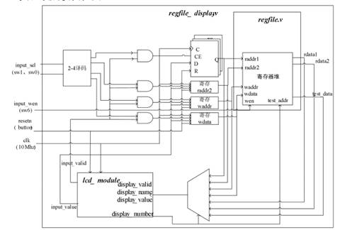
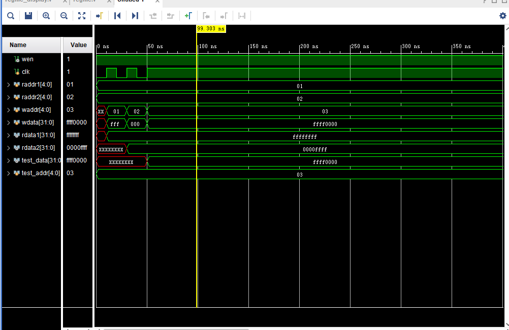
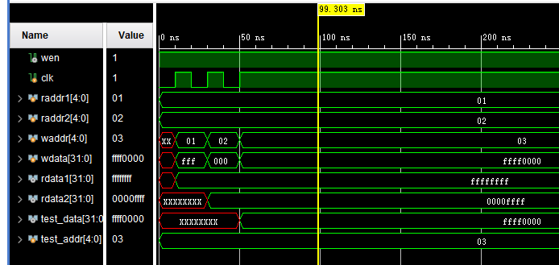
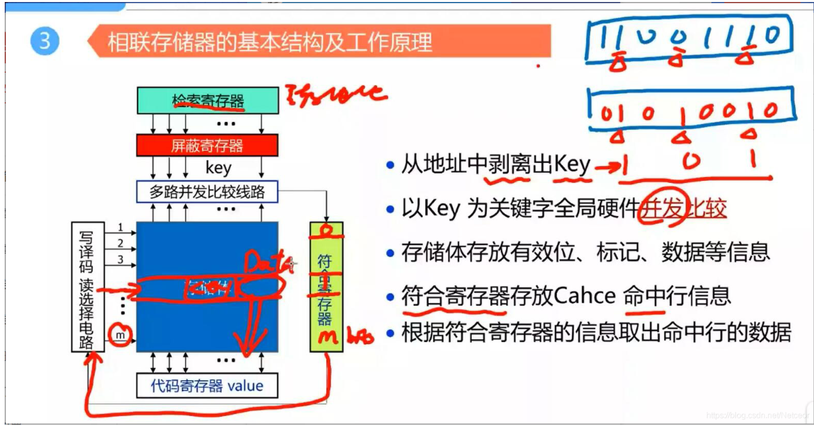

# 实验三 寄存器堆的实现

**时间：2022年5月22日**

**姓名：王天一 320200931301**

## 实验目的

1. 熟悉并掌握 MIPS 计算机中寄存器堆的原理和设计方法。

2. 初步了解 MIPS 指令结构和源操作数/目的操作数的概念。 

3. 熟悉并运用 Verilog 语言进行电路设计。 

4. 为后续设计 CPU 的实验打下基础。

## 实验设备

1. 装有 Xilinx Vivado 的计算机一台。 

2. LS-CPU-EXB-002 教学系统实验箱一套。

## 课设分析与设计

### 课设原理

### 端口设计

#### 寄存器端口设计

标准的寄存器堆有两个读端口、一个写端口，能够同时读出2个寄存器的值，写入1个寄存器。本次实验的寄存器堆另外新增一个读端口用于测试，即一共三个读端口。寄存器端口如下：

- clk：时钟信号（input）

- wen：寄存器写使能（input）

- raddr1：寄存器读地址1（input）

- raddr2：寄存器读地址2（input）

- waddr：寄存器写地址（input）

- rdata1：寄存器读端口1读出的数据（output）

- rdata2：寄存器读端口2读出的数据（output）

- test_addr：用于测试的读端口 （input）

- test_data：测试读端口读出的数据（output）

### 设计框图

#### 寄存器堆设计



## 代码实现

### 寄存器堆

```verilog
module regfile(
    input             clk,
    input             wen,
    input      [4 :0] raddr1,
    input      [4 :0] raddr2,
    input      [4 :0] waddr,
    input      [31:0] wdata,
    output reg [31:0] rdata1,
    output reg [31:0] rdata2,
    input      [4 :0] test_addr,
    output reg [31:0] test_data
    );
    reg [31:0] rf[31:0];
     
    // three ported register file
    // read two ports combinationally
    // write third port on rising edge of clock
    // register 0 hardwired to 0

    always @(posedge clk)
    begin
        if (wen) 
        begin
            rf[waddr] <= wdata;
        end
    end
     
    //读端口1
    always @(*)
    begin
        case (raddr1)
            5'd1 : rdata1 <= rf[1 ];
            5'd2 : rdata1 <= rf[2 ];
            5'd3 : rdata1 <= rf[3 ];
            5'd4 : rdata1 <= rf[4 ];
            5'd5 : rdata1 <= rf[5 ];
            5'd6 : rdata1 <= rf[6 ];
            5'd7 : rdata1 <= rf[7 ];
            5'd8 : rdata1 <= rf[8 ];
            5'd9 : rdata1 <= rf[9 ];
            5'd10: rdata1 <= rf[10];
            5'd11: rdata1 <= rf[11];
            5'd12: rdata1 <= rf[12];
            5'd13: rdata1 <= rf[13];
            5'd14: rdata1 <= rf[14];
            5'd15: rdata1 <= rf[15];
            5'd16: rdata1 <= rf[16];
            5'd17: rdata1 <= rf[17];
            5'd18: rdata1 <= rf[18];
            5'd19: rdata1 <= rf[19];
            5'd20: rdata1 <= rf[20];
            5'd21: rdata1 <= rf[21];
            5'd22: rdata1 <= rf[22];
            5'd23: rdata1 <= rf[23];
            5'd24: rdata1 <= rf[24];
            5'd25: rdata1 <= rf[25];
            5'd26: rdata1 <= rf[26];
            5'd27: rdata1 <= rf[27];
            5'd28: rdata1 <= rf[28];
            5'd29: rdata1 <= rf[29];
            5'd30: rdata1 <= rf[30];
            5'd31: rdata1 <= rf[31];
            default : rdata1 <= 32'd0;
        endcase
    end
    //读端口2
    always @(*)
    begin
        case (raddr2)
            5'd1 : rdata2 <= rf[1 ];
            5'd2 : rdata2 <= rf[2 ];
            5'd3 : rdata2 <= rf[3 ];
            5'd4 : rdata2 <= rf[4 ];
            5'd5 : rdata2 <= rf[5 ];
            5'd6 : rdata2 <= rf[6 ];
            5'd7 : rdata2 <= rf[7 ];
            5'd8 : rdata2 <= rf[8 ];
            5'd9 : rdata2 <= rf[9 ];
            5'd10: rdata2 <= rf[10];
            5'd11: rdata2 <= rf[11];
            5'd12: rdata2 <= rf[12];
            5'd13: rdata2 <= rf[13];
            5'd14: rdata2 <= rf[14];
            5'd15: rdata2 <= rf[15];
            5'd16: rdata2 <= rf[16];
            5'd17: rdata2 <= rf[17];
            5'd18: rdata2 <= rf[18];
            5'd19: rdata2 <= rf[19];
            5'd20: rdata2 <= rf[20];
            5'd21: rdata2 <= rf[21];
            5'd22: rdata2 <= rf[22];
            5'd23: rdata2 <= rf[23];
            5'd24: rdata2 <= rf[24];
            5'd25: rdata2 <= rf[25];
            5'd26: rdata2 <= rf[26];
            5'd27: rdata2 <= rf[27];
            5'd28: rdata2 <= rf[28];
            5'd29: rdata2 <= rf[29];
            5'd30: rdata2 <= rf[30];
            5'd31: rdata2 <= rf[31];
            default : rdata2 <= 32'd0;
        endcase
    end
     //调试端口，读出寄存器值显示在触摸屏上
    always @(*)
    begin
        case (test_addr)
            5'd1 : test_data <= rf[1 ];
            5'd2 : test_data <= rf[2 ];
            5'd3 : test_data <= rf[3 ];
            5'd4 : test_data <= rf[4 ];
            5'd5 : test_data <= rf[5 ];
            5'd6 : test_data <= rf[6 ];
            5'd7 : test_data <= rf[7 ];
            5'd8 : test_data <= rf[8 ];
            5'd9 : test_data <= rf[9 ];
            5'd10: test_data <= rf[10];
            5'd11: test_data <= rf[11];
            5'd12: test_data <= rf[12];
            5'd13: test_data <= rf[13];
            5'd14: test_data <= rf[14];
            5'd15: test_data <= rf[15];
            5'd16: test_data <= rf[16];
            5'd17: test_data <= rf[17];
            5'd18: test_data <= rf[18];
            5'd19: test_data <= rf[19];
            5'd20: test_data <= rf[20];
            5'd21: test_data <= rf[21];
            5'd22: test_data <= rf[22];
            5'd23: test_data <= rf[23];
            5'd24: test_data <= rf[24];
            5'd25: test_data <= rf[25];
            5'd26: test_data <= rf[26];
            5'd27: test_data <= rf[27];
            5'd28: test_data <= rf[28];
            5'd29: test_data <= rf[29];
            5'd30: test_data <= rf[30];
            5'd31: test_data <= rf[31];
            default : test_data <= 32'd0;
        endcase
    end
endmodule
```

## 仿真及其波形



## 上板验证

### 图片


## 问题

### 结合代码和仿真结果讲解寄存器堆的实现

所谓寄存器堆，就是一个寄存器的集合，为方便访问其中的寄存器，对寄存器堆中的寄存器进行统一编码，称为寄存器号或者寄存器地址，每个寄存器均通过制定寄存器号进行访问。

MIPS计算机中有32个寄存器，每个寄存器32位，其中0号寄存器的读出结果设置为0，本实验即要求设计一个32*32位的寄存器堆。要求异步读同步写，即读操作不需要时钟控制，写操作需要在时钟上升沿才能写入。



从波形中可以看到，写使能一直为高电平，两个寄存器的端口号为1和2，在第一个时钟上升沿到来之前，1、2号寄存器的值都为不定态，当第一个时钟信号到来时，给1号寄存器写入32’hffffffff，由于是异步读，故写入后即可看见它的值；当第二个时钟信号上升沿到来时，给2号寄存器写入32’hffff，同样写入即可读到其值。在测试端口这边，只有等3号寄存器被写入值后才能读到数据，进一步验证了其异步读同步写的功能。

再回过头查看我们的代码，写操作的定义如下

```verilog
    always @(posedge clk)
    begin
        if (wen) 
        begin
            rf[waddr] <= wdata;
        end
    end
```

可以看出来其只在时钟上升沿刷新。

但是再去看我们读的代码：

```verilog
always @(*)
    begin
        case (raddr1)
            5'd1 : rdata1 <= rf[1 ];
            5'd2 : rdata1 <= rf[2 ];
            5'd3 : rdata1 <= rf[3 ];
            5'd4 : rdata1 <= rf[4 ];
            5'd5 : rdata1 <= rf[5 ];
            5'd6 : rdata1 <= rf[6 ];
            5'd7 : rdata1 <= rf[7 ];
            5'd8 : rdata1 <= rf[8 ];
            5'd9 : rdata1 <= rf[9 ];
            5'd10: rdata1 <= rf[10];
            5'd11: rdata1 <= rf[11];
            5'd12: rdata1 <= rf[12];
            5'd13: rdata1 <= rf[13];
            5'd14: rdata1 <= rf[14];
            5'd15: rdata1 <= rf[15];
            5'd16: rdata1 <= rf[16];
            5'd17: rdata1 <= rf[17];
            5'd18: rdata1 <= rf[18];
            5'd19: rdata1 <= rf[19];
            5'd20: rdata1 <= rf[20];
            5'd21: rdata1 <= rf[21];
            5'd22: rdata1 <= rf[22];
            5'd23: rdata1 <= rf[23];
            5'd24: rdata1 <= rf[24];
            5'd25: rdata1 <= rf[25];
            5'd26: rdata1 <= rf[26];
            5'd27: rdata1 <= rf[27];
            5'd28: rdata1 <= rf[28];
            5'd29: rdata1 <= rf[29];
            5'd30: rdata1 <= rf[30];
            5'd31: rdata1 <= rf[31];
            default : rdata1 <= 32'd0;
        endcase
    end
```

可以看出来异步读取是使用`always@(*)`来实现的，即有任意输入改变，执行下面的代码。

### 进阶

一般的存储器都是按照地址存储的，但在某些特殊的场合（比如Cache、快表等），会用到一种不同的存储器——相联存储器。相联存储器是按照内容访问的存储器，即访问它时所用到的“地址”是与想要访问的内容直接相关的。相联存储器的存储单元可以被视为一个二维的阵列；写入时无需地址，直接按照一定规则，在特定的存储空间按照顺序依次写入；读取时，CPU给出相联关键字（即“地址”），相联存储器根据这一关键字并行地从两个维度对各存储单元中对应的内容进行比较，如果命中，则读取出相应单元的信息。它主要由检索寄存器、屏蔽寄存器、符合寄存器、多路并发比较线路等组成。试学习相联存储的原理，并将之实现，结合代码与仿真结果进行讲解。



相联存储器的原理：

1. 我们要找寻的信息（即要找的主存地址）放置在检索寄存器中， 通过屏蔽寄存器得到key

   **屏蔽寄存器原理**：如图片右上方，假如我们要比较的只是画三角形的3bit，则屏蔽寄存器中将该3位设为1，其余为0，这样通过屏蔽寄存器后就只会得到我们所需要的3位，作为我们的key。图中，由01010010，知第1、3、6位是我们标记的位。则原数据11001110通过后只取该三位，得到key=101

2. 读选择电路的m代表了cache行，如图中即有m行cache，将m行与key在多路并发比较线路中比较，比较结果存储在符合寄存器中。

   符合寄存器内容：如果key值完全相同，则相应位为1。

3. 符合寄存器中为1的单元位置传入读选择电路=选中匹配成功的存储单元/一行

4. 将选中存储单元的data信息传入到代码寄存器，得到我们要的内容
