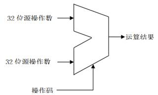
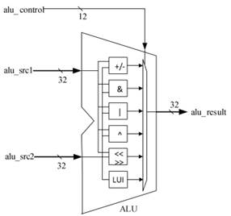
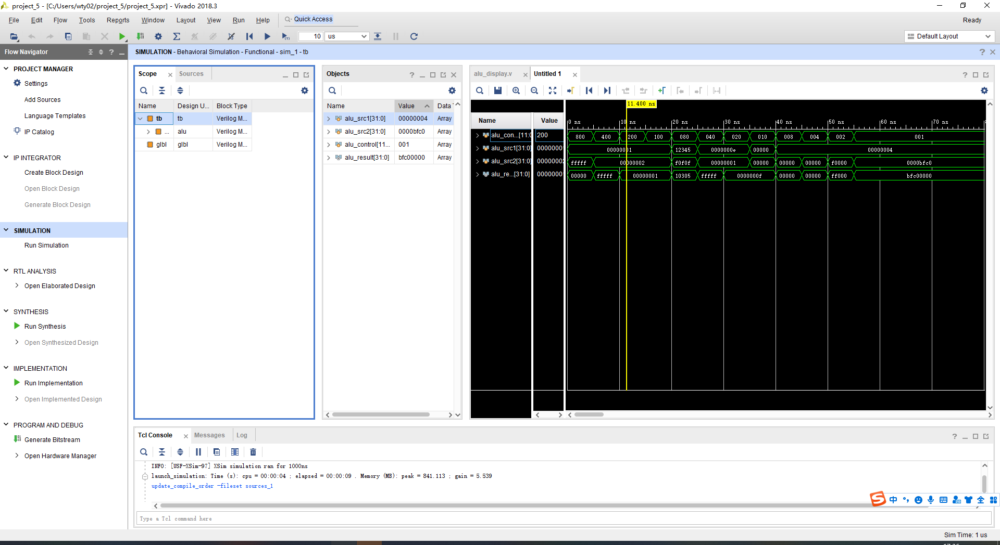
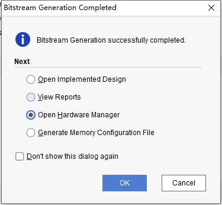
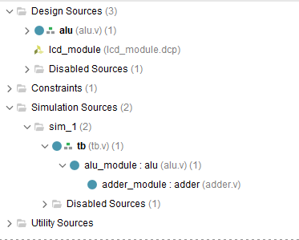
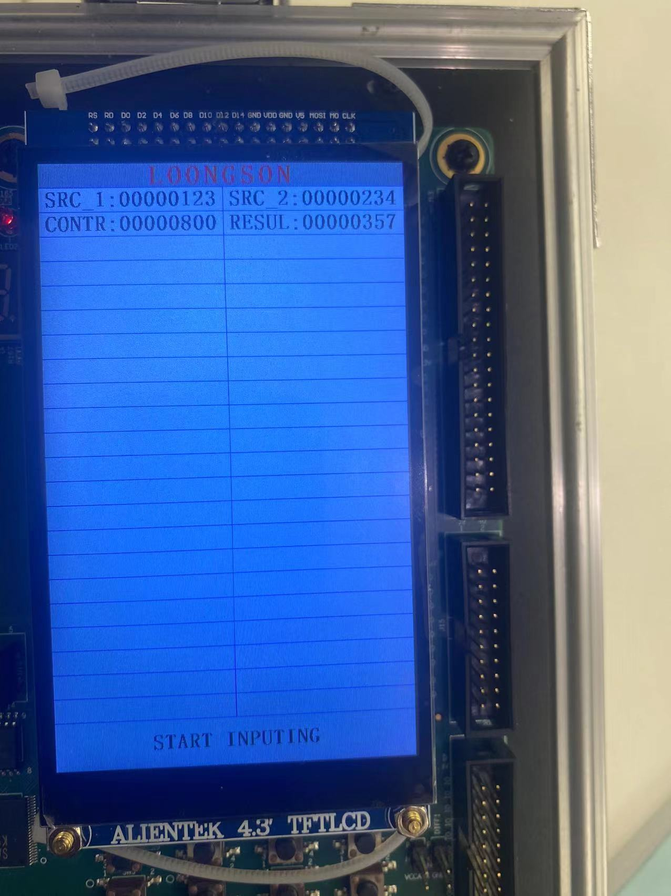

# 实验四 ALU

**姓名：王天一**

**学号：320200931301**

**日期：2022年6月12日**

## 实验目的

1. 熟悉 MIPS 指令集中的运算指令， 学会对这些指令进行归纳分类。

2. 了解 MIPS 指令结构。

3. 熟悉并掌握 ALU 的原理、 功能和设计。

4. 进一步加强运用 verilog 语言进行电路设计的能力。

5. 为后续设计 cpu 的实验打下基础。
## 课设器材与设备

1. 装有 Xilinx Vivado 的计算机一台。 

2. LS-CPU-EXB-002 教学系统实验箱一套。

## 原理分析

### 主要原理

​	如上图所示，由操作码确定具体要做的运算，本次实验中ALU可以做如下12种运算：加法、减法、有符号比较，小于置位、无符号比较，小于置位、按位与、按位或非、按位或、按位异或、逻辑左移、逻辑右移、算术右移、高位加载。实际上所有运算都会做一遍，由操作码选择具体某一运算结果，可将操作码设计为独热码，本实验中使用独热码对各类操作编码，这样使得具体的操作编码可以不受指令集编码的约束，调整较灵活。此外也设计了基于MIPS指令集编码的ALU，根据每条指令特殊位的不同之处，采用选择器层层串联的方式来选出最终要做的操作运算结果。

   

### 输入输出设计

alu_control：ALU控制信号，12位，用于选择具体的运算操作（input）。

alu_src1，alu_src2：输入ALU的原操作数，32位（input）。

alu_result：32位，ALU的结果输出（output）。

### 设计框图

内部构造如下



## 实际实现

### 代码实现

ALU显示模块如下

```verilog
module alu_display(
    //时钟与复位信号
     input clk,
    input resetn,    //后缀"n"代表低电平有效

    //拨码开关，用于选择输入数
    input [1:0] input_sel, //00:输入为控制信号(alu_control)
                           //10:输入为源操作数1(alu_src1)
                           //11:输入为源操作数2(alu_src2)

    //触摸屏相关接口，不需要更改
    output lcd_rst,
    output lcd_cs,
    output lcd_rs,
    output lcd_wr,
    output lcd_rd,
    inout[15:0] lcd_data_io,
    output lcd_bl_ctr,
    inout ct_int,
    inout ct_sda,
    output ct_scl,
    output ct_rstn
    );
//-----{调用ALU模块}begin
    reg   [11:0] alu_control;  // ALU控制信号
    reg   [31:0] alu_src1;     // ALU操作数1
    reg   [31:0] alu_src2;     // ALU操作数2
    wire  [31:0] alu_result;   // ALU结果
    alu alu_module(
        .alu_control(alu_control),
        .alu_src1   (alu_src1   ),
        .alu_src2   (alu_src2   ),
        .alu_result (alu_result )
    );
//-----{调用ALU模块}end

//---------------------{调用触摸屏模块}begin--------------------//
//-----{实例化触摸屏}begin
//此小节不需要更改
    reg         display_valid;
    reg  [39:0] display_name;
    reg  [31:0] display_value;
    wire [5 :0] display_number;
    wire        input_valid;
    wire [31:0] input_value;

    lcd_module lcd_module(
        .clk            (clk           ),   //10Mhz
        .resetn         (resetn        ),

        //调用触摸屏的接口
        .display_valid  (display_valid ),
        .display_name   (display_name  ),
        .display_value  (display_value ),
        .display_number (display_number),
        .input_valid    (input_valid   ),
        .input_value    (input_value   ),

        //lcd触摸屏相关接口，不需要更改
        .lcd_rst        (lcd_rst       ),
        .lcd_cs         (lcd_cs        ),
        .lcd_rs         (lcd_rs        ),
        .lcd_wr         (lcd_wr        ),
        .lcd_rd         (lcd_rd        ),
        .lcd_data_io    (lcd_data_io   ),
        .lcd_bl_ctr     (lcd_bl_ctr    ),
        .ct_int         (ct_int        ),
        .ct_sda         (ct_sda        ),
        .ct_scl         (ct_scl        ),
        .ct_rstn        (ct_rstn       )
    ); 
//-----{实例化触摸屏}end

//-----{从触摸屏获取输入}begin
//根据实际需要输入的数修改此小节，
//建议对每一个数的输入，编写单独一个always块
    //当input_sel为00时，表示输入数控制信号，即alu_control
    always @(posedge clk)
    begin
        if (!resetn)
        begin
            alu_control <= 12'd0;
        end
        else if (input_valid && input_sel==2'b00)
        begin
            alu_control <= input_value[11:0];
        end
    end
    
    //当input_sel为10时，表示输入数为源操作数1，即alu_src1
    always @(posedge clk)
    begin
        if (!resetn)
        begin
            alu_src1 <= 32'd0;
        end
        else if (input_valid && input_sel==2'b10)
        begin
            alu_src1 <= input_value;
        end
    end

    //当input_sel为11时，表示输入数为源操作数2，即alu_src2
    always @(posedge clk)
    begin
        if (!resetn)
        begin
            alu_src2 <= 32'd0;
        end
        else if (input_valid && input_sel==2'b11)
        begin
            alu_src2 <= input_value;
        end
    end
//-----{从触摸屏获取输入}end

//-----{输出到触摸屏显示}begin
//根据需要显示的数修改此小节，
//触摸屏上共有44块显示区域，可显示44组32位数据
//44块显示区域从1开始编号，编号为1~44，
    always @(posedge clk)
    begin
        case(display_number)
            6'd1 :
            begin
                display_valid <= 1'b1;
                display_name  <= "SRC_1";
                display_value <= alu_src1;
            end
            6'd2 :
            begin
                display_valid <= 1'b1;
                display_name  <= "SRC_2";
                display_value <= alu_src2;
            end
            6'd3 :
            begin
                display_valid <= 1'b1;
                display_name  <= "CONTR";
                display_value <={20'd0, alu_control};
            end
            6'd4 :
            begin
                display_valid <= 1'b1;
                display_name  <= "RESUL";
                display_value <= alu_result;
            end
            default :
            begin
                display_valid <= 1'b0;
                display_name  <= 40'd0;
                display_value <= 32'd0;
            end
        endcase
    end
//-----{输出到触摸屏显示}end
//----------------------{调用触摸屏模块}end---------------------//
endmodule
```

ALU代码如下

```verilog
`timescale 1ns / 1ps
module alu(
    input  [11:0] alu_control,  // ALU控制信号
    input  [31:0] alu_src1,     // ALU操作数1,为补码
    input  [31:0] alu_src2,     // ALU操作数2，为补码
    output [31:0] alu_result    // ALU结果
    );

    // ALU控制信号，独热码
    wire alu_add;   //加法操作
    wire alu_sub;   //减法操作
    wire alu_slt;   //有符号比较，小于置位，复用加法器做减法
    wire alu_sltu;  //无符号比较，小于置位，复用加法器做减法
    wire alu_and;   //按位与
    wire alu_nor;   //按位或非
    wire alu_or;    //按位或
    wire alu_xor;   //按位异或
    wire alu_sll;   //逻辑左移
    wire alu_srl;   //逻辑右移
    wire alu_sra;   //算术右移
    wire alu_lui;   //高位加载

    assign alu_add  = alu_control[11];
    assign alu_sub  = alu_control[10];
    assign alu_slt  = alu_control[ 9];
    assign alu_sltu = alu_control[ 8];
    assign alu_and  = alu_control[ 7];
    assign alu_nor  = alu_control[ 6];
    assign alu_or   = alu_control[ 5];
    assign alu_xor  = alu_control[ 4];
    assign alu_sll  = alu_control[ 3];
    assign alu_srl  = alu_control[ 2];
    assign alu_sra  = alu_control[ 1];
    assign alu_lui  = alu_control[ 0];

    wire [31:0] add_sub_result;
    wire [31:0] slt_result;
    wire [31:0] sltu_result;
    wire [31:0] and_result;
    wire [31:0] nor_result;
    wire [31:0] or_result;
    wire [31:0] xor_result;
    wire [31:0] sll_result;
    wire [31:0] srl_result;
    wire [31:0] sra_result;
    wire [31:0] lui_result;

    assign and_result = alu_src1 & alu_src2;      // 与结果为两数按位与
    assign or_result  = alu_src1 | alu_src2;      // 或结果为两数按位或
    assign nor_result = ~or_result;               // 或非结果为或结果按位取反
    assign xor_result = alu_src1 ^ alu_src2;      // 异或结果为两数按位异或
    assign lui_result = {alu_src2[15:0], 16'd0};  // 立即数装载结果为立即数移位至高半字节

//-----{加法器}begin
//add,sub,slt,sltu均使用该模块
    wire [31:0] adder_operand1;
    wire [31:0] adder_operand2;
    wire        adder_cin     ;
    wire [31:0] adder_result  ;
    wire        adder_cout    ;
    assign adder_operand1 = alu_src1; 
    assign adder_operand2 = alu_add ? alu_src2 : ~alu_src2; 
    assign adder_cin      = ~alu_add; //减法需要cin 
    adder adder_module(
    .operand1(adder_operand1),
    .operand2(adder_operand2),
    .cin     (adder_cin     ),
    .result  (adder_result  ),
    .cout    (adder_cout    )
    );

    //加减结果
    assign add_sub_result = adder_result;

    //slt结果
    //adder_src1[31] adder_src2[31] adder_result[31]
    //       0             1           X(0或1)       "正-负"，显然小于不成立
    //       0             0             1           相减为负，说明小于
    //       0             0             0           相减为正，说明不小于
    //       1             1             1           相减为负，说明小于
    //       1             1             0           相减为正，说明不小于
    //       1             0           X(0或1)       "负-正"，显然小于成立
    assign slt_result[31:1] = 31'd0;
    assign slt_result[0]    = (alu_src1[31] & ~alu_src2[31]) | (~(alu_src1[31]^alu_src2[31]) & adder_result[31]);

    //sltu结果
    //对于32位无符号数比较，相当于33位有符号数（{1'b0,src1}和{1'b0,src2}）的比较，最高位0为符号位
    //故，可以用33位加法器来比较大小，需要对{1'b0,src2}取反,即需要{1'b0,src1}+{1'b1,~src2}+cin
    //但此处用的为32位加法器，只做了运算:                             src1   +    ~src2   +cin
    //32位加法的结果为{adder_cout,adder_result},则33位加法结果应该为{adder_cout+1'b1,adder_result}
    //对比slt结果注释，知道，此时判断大小属于第二三种情况，即源操作数1符号位为0，源操作数2符号位为0
    //结果的符号位为1，说明小于，即adder_cout+1'b1为2'b01，即adder_cout为0
    assign sltu_result = {31'd0, ~adder_cout};
//-----{加法器}end

//-----{移位器}begin
    // 移位分三步进行，
    // 第一步根据移位量低2位即[1:0]位做第一次移位，
    // 第二步在第一次移位基础上根据移位量[3:2]位做第二次移位，
    // 第三步在第二次移位基础上根据移位量[4]位做第三次移位。
    wire [4:0] shf;
    assign shf = alu_src1[4:0];
    wire [1:0] shf_1_0;
    wire [1:0] shf_3_2;
    assign shf_1_0 = shf[1:0];
    assign shf_3_2 = shf[3:2];
    
     // 逻辑左移
    wire [31:0] sll_step1;
    wire [31:0] sll_step2;
    assign sll_step1 = {32{shf_1_0 == 2'b00}} & alu_src2                   // 若shf[1:0]="00",不移位
                     | {32{shf_1_0 == 2'b01}} & {alu_src2[30:0], 1'd0}     // 若shf[1:0]="01",左移1位
                     | {32{shf_1_0 == 2'b10}} & {alu_src2[29:0], 2'd0}     // 若shf[1:0]="10",左移2位
                     | {32{shf_1_0 == 2'b11}} & {alu_src2[28:0], 3'd0};    // 若shf[1:0]="11",左移3位
    assign sll_step2 = {32{shf_3_2 == 2'b00}} & sll_step1                  // 若shf[3:2]="00",不移位
                     | {32{shf_3_2 == 2'b01}} & {sll_step1[27:0], 4'd0}    // 若shf[3:2]="01",第一次移位结果左移4位
                     | {32{shf_3_2 == 2'b10}} & {sll_step1[23:0], 8'd0}    // 若shf[3:2]="10",第一次移位结果左移8位
                     | {32{shf_3_2 == 2'b11}} & {sll_step1[19:0], 12'd0};  // 若shf[3:2]="11",第一次移位结果左移12位
    assign sll_result = shf[4] ? {sll_step2[15:0], 16'd0} : sll_step2;     // 若shf[4]="1",第二次移位结果左移16位

    // 逻辑右移
    wire [31:0] srl_step1;
    wire [31:0] srl_step2;
    assign srl_step1 = {32{shf_1_0 == 2'b00}} & alu_src2                   // 若shf[1:0]="00",不移位
                     | {32{shf_1_0 == 2'b01}} & {1'd0, alu_src2[31:1]}     // 若shf[1:0]="01",右移1位,高位补0
                     | {32{shf_1_0 == 2'b10}} & {2'd0, alu_src2[31:2]}     // 若shf[1:0]="10",右移2位,高位补0
                     | {32{shf_1_0 == 2'b11}} & {3'd0, alu_src2[31:3]};    // 若shf[1:0]="11",右移3位,高位补0
    assign srl_step2 = {32{shf_3_2 == 2'b00}} & srl_step1                  // 若shf[3:2]="00",不移位
                     | {32{shf_3_2 == 2'b01}} & {4'd0, srl_step1[31:4]}    // 若shf[3:2]="01",第一次移位结果右移4位,高位补0
                     | {32{shf_3_2 == 2'b10}} & {8'd0, srl_step1[31:8]}    // 若shf[3:2]="10",第一次移位结果右移8位,高位补0
                     | {32{shf_3_2 == 2'b11}} & {12'd0, srl_step1[31:12]}; // 若shf[3:2]="11",第一次移位结果右移12位,高位补0
    assign srl_result = shf[4] ? {16'd0, srl_step2[31:16]} : srl_step2;    // 若shf[4]="1",第二次移位结果右移16位,高位补0
 
    // 算术右移
    wire [31:0] sra_step1;
    wire [31:0] sra_step2;
    assign sra_step1 = {32{shf_1_0 == 2'b00}} & alu_src2                                 // 若shf[1:0]="00",不移位
                     | {32{shf_1_0 == 2'b01}} & {alu_src2[31], alu_src2[31:1]}           // 若shf[1:0]="01",右移1位,高位补符号位
                     | {32{shf_1_0 == 2'b10}} & {{2{alu_src2[31]}}, alu_src2[31:2]}      // 若shf[1:0]="10",右移2位,高位补符号位
                     | {32{shf_1_0 == 2'b11}} & {{3{alu_src2[31]}}, alu_src2[31:3]};     // 若shf[1:0]="11",右移3位,高位补符号位
    assign sra_step2 = {32{shf_3_2 == 2'b00}} & sra_step1                                // 若shf[3:2]="00",不移位
                     | {32{shf_3_2 == 2'b01}} & {{4{sra_step1[31]}}, sra_step1[31:4]}    // 若shf[3:2]="01",第一次移位结果右移4位,高位补符号位
                     | {32{shf_3_2 == 2'b10}} & {{8{sra_step1[31]}}, sra_step1[31:8]}    // 若shf[3:2]="10",第一次移位结果右移8位,高位补符号位
                     | {32{shf_3_2 == 2'b11}} & {{12{sra_step1[31]}}, sra_step1[31:12]}; // 若shf[3:2]="11",第一次移位结果右移12位,高位补符号位
    assign sra_result = shf[4] ? {{16{sra_step2[31]}}, sra_step2[31:16]} : sra_step2;    // 若shf[4]="1",第二次移位结果右移16位,高位补符号位
//-----{移位器}end

    // 选择相应结果输出
    assign alu_result = (alu_add|alu_sub) ? add_sub_result[31:0] : 
                        alu_slt           ? slt_result :
                        alu_sltu          ? sltu_result :
                        alu_and           ? and_result :
                        alu_nor           ? nor_result :
                        alu_or            ? or_result  :
                        alu_xor           ? xor_result :
                        alu_sll           ? sll_result :
                        alu_srl           ? srl_result :
                        alu_sra           ? sra_result :
                        alu_lui           ? lui_result :
                        32'd0;
endmodule

```

加法器的实现如下

```verilog
`timescale 1ns / 1ps
module adder(
    input  [31:0] operand1,
    input  [31:0] operand2,
    input         cin,
    output [31:0] result,
    output        cout
    );
    assign {cout,result} = operand1 + operand2 + cin;
endmodule
```

### 功能仿真

测试的代码如下

```verilog
`timescale 1ns / 1ps

////////////////////////////////////////////////////////////////////////////////
// Company: 
// Engineer:
//
// Target Device:  
// Tool versions:  
// Dependencies:
// 
// Revision:
// Revision 0.01 - File Created
// Additional Comments:
// 
////////////////////////////////////////////////////////////////////////////////

module tb;

    reg   [11:0] alu_control;
    reg   [31:0] alu_src1;   
    reg   [31:0] alu_src2;   
    wire  [31:0] alu_result; 
    alu alu_module(
        .alu_control(alu_control),
        .alu_src1   (alu_src1   ),
        .alu_src2   (alu_src2   ),
        .alu_result (alu_result )
    );

    initial begin
        //加法操作
        alu_control = 12'b1000_0000_0000;
        alu_src1 = 32'd1;
        alu_src2 = 32'hffffffff;

        //减法操作
        #5;
        alu_control = 12'b0100_0000_0000;
        alu_src1 = 32'd1;
        alu_src2 = 32'd2;
        
        //有符号比较
        #5;
        alu_control = 12'b0010_0000_0000;
        alu_src1 = 32'd1;
        alu_src2 = 32'd2;
        
        //无符号比较
        #5;
        alu_control = 12'b0001_0000_0000;
        alu_src1 = 32'd1;
        alu_src2 = 32'd2;
        
        //按位与
        #5;
        alu_control = 12'b0000_1000_0000;
        alu_src1 = 32'h12345678;
        alu_src2 = 32'hf0f0f0f0;
        
        //按位或非
        #5;
        alu_control = 12'b0000_0100_0000;
        alu_src1 = 32'he;
        alu_src2 = 32'd1;

        //按位或
        #5;
        alu_control = 12'b0000_0010_0000;
        alu_src1 = 32'he;
        alu_src2 = 32'd1;
        
        //按位异或
        #5;
        alu_control = 12'b0000_0001_0000;
        alu_src1 = 32'b1010;
        alu_src2 = 32'b0101;
        
        //逻辑左移
        #5;
        alu_control = 12'b0000_0000_1000;
        alu_src1 = 32'd4;
        alu_src2 = 32'hf;
        
        //逻辑右移
        #5;
        alu_control = 12'b0000_0000_0100;
        alu_src1 = 32'd4;
        alu_src2 = 32'hf0;

        //算术右移        
        #5;
        alu_control = 12'b0000_0000_0010;
        alu_src1 = 32'd4;
        alu_src2 = 32'hf0000000;

        //高位加载    
        #5;
        alu_control = 12'b0000_0000_0001;
        alu_src2 = 32'hbfc0;
    end
endmodule
```

功能仿真的结果如下：



### 生成比特流

生成比特流的成功截图如下



### 项目构成

项目构成如下



### 上板实验



## 思考题

1. ALU的结构如何，由哪些部分组成？不同的运算器之间是什么关系？
   ALU内部主要由各类运算逻辑和选择逻辑构成，由输入的操作码选择具体的运算结果。各个运算器之间有并列与依赖关系，首先，对于加减法、与运算等逻辑运算、高位加载、位移运算等都为并列关系，互相独立：

   ```verilog
   assign and_result = alu_src1 & alu_src2;  // &
   assign or_result  = alu_src1 | alu_src2;  // |
   assign nor_result = ~or_result; // nor
   assign xor_result = alu_src1 ^ alu_src2;// xor
   assign lui_result = {alu_src2[15:0], 16'd0};//加载到高16位
   //add,sub,slt,sltu
   wire [31:0] adder_operand1;
   wire [31:0] adder_operand2;
   wire  adder_cin;
   wire [31:0] adder_result;
   wire  adder_cout;
   assign adder_operand1 = alu_src1;
   assign adder_operand2 = alu_add ? alu_src2 : ~alu_src2;
   assign adder_cin  = ~alu_add; //减法时adder_cin置为1，即补码等于反码加1
   assign {adder_cout, adder_result} = adder_operand1 + adder_operand2 +  adder_cin;
   //加减结果
   assign add_sub_result = adder_result;
   
   ```

   对于比较运算可以复用加减的运算逻辑，需要依赖于减法的运算结果，在此基础上做特殊的判断才能得到结果。

   对于 32 位无符号比较的小于置位，可在其高位前填 0 组合为 33位正数的比较，即{1’b0,src1}和{1’b0,src2}的比较，最高位符号位为 0。对于正数的比较，只要减法结果的符号位为1，则表示小于。而 33 位正数相减，其结果的符号位 最终可由 32 位加法的 cout+1’b1 得到，故无符号 32 位比较小于置位运算结 果表达式为：sltu_result = ~adder_cout。
   ```verilog
   //slt
   assign slt_result[31:1] = 31'd0;
   assign slt_result[0]=(alu_src1[31] & ~alu_src2[31]) 	|   (~(alu_src1[31]^alu_src2[31]) & adder_result[31]);
   
   assign sltu_result = {31'd0, ~adder_cout}; 
   
   //移位器
   assign sll_result = alu_src2 << alu_src1[4:0];
   assign srl_result = alu_src2 >> alu_src1[4:0];
   assign sra_result = ($signed(alu_src2)) >>> alu_src1[4:0];
   
   
   // 选择相应结果输出
   assign alu_result = (alu_add|alu_sub) ? add_sub_result[31:0] : 
                        alu_slt ? slt_result :
                        alu_sltu  ? sltu_result :
                        alu_and  ? and_result :
                        alu_nor  ? nor_result :
                        alu_or ? or_result :
                        alu_xor  ? xor_result :
                        alu_sll  ? sll_result :
                        alu_srl  ? srl_result :
                        alu_sra  ? sra_result :
                        alu_lui  ? lui_result :
                        32'd0;
   ```

   

2. 在本次实验中，有些指令的实现并没有它的含义看上去那么直接。另外，ALU只是负责指令中运算部分的执行，单看ALU，并不能看到指令的完整实现。结合代码和仿真结果详细讲解SLT指令、移位系列指令的原理和实现，并结合具体指令谈谈对上面两句话的理解。
   对于SLT指令：
   
   | src1符号 | src2符号 | adder_result符号 |                  |
   | -------- | -------- | ---------------- | ---------------- |
   | 0        | 1        | X(0/1)           | 正-负，必然大于0 |
   | 0        | 0        | 1                | 正-正，大于情况  |
   | 0        | 0        | 0                | 正-正，小于情况  |
   | 1        | 1        | 1                | 负-负，小于情况  |
   | 1        | 1        | 0                | 负-负，大于情况  |
   | 1        | 0        | X(0/1)           | 负-正，必然小于  |
   
   由上表可以归纳得到SLT的结果：
   ```verilog
   assign slt_result[0]=(alu_src1[31] & ~alu_src2[31]) 	|   (~(alu_src1[31]^alu_src2[31]) & adder_result[31]);
   ```
   
   其中adder_result为两输入数经过减法器的输出结果，可见这里的有符号比较依赖于减法操作，通过上表的归纳得到SLT的运算逻辑。
   
   对于移位系列的操作，常见的做法是分为多步移位，具体来说可以进行三次位移，第一步根据移位量低2位即[1:0]位做第一次移位，第二步在第一次移位基础上根据移位量[3:2]位做第二次移位，第三步在第二次移位基础上根据移位量[4]位做第三次移位。
   
   具体代码如下：
   ```verilog
   wire [4:0] shf;
   assign shf = alu_src1[4:0]; 
   wire [1:0] shf_1_0; 
   wire [1:0] shf_3_2; 
   assign shf_1_0 = shf[1:0]; 
   assign shf_3_2 = shf[3:2]; 
   // 逻辑左移 
   wire [31:0] sll_step1; 
   wire [31:0] sll_step2; 
   // 依据 shf[1:0],左移 0、1、2、3 位 
   assign sll_step1 = {32{shf_1_0 == 2'b00}} & alu_src2 
                   | {32{shf_1_0 == 2'b01}} & {alu_src2[30:0], 1'd0}
                   | {32{shf_1_0 == 2'b10}} & {alu_src2[29:0], 2'd0}
                   | {32{shf_1_0 == 2'b11}} & {alu_src2[28:0], 3'd0};
   // 依据 shf[3:2],将第一次移位结果左移 0、4、8、12 位
   assign sll_step2 = {32{shf_3_2 == 2'b00}} & sll_step1 
                   | {32{shf_3_2 == 2'b01}} & {sll_step1[27:0], 4'd0} 
                   | {32{shf_3_2 == 2'b10}} & {sll_step1[23:0], 8'd0} 
                   | {32{shf_3_2 == 2'b11}} & {sll_step1[19:0], 12'd0}; 
   // 依据 shf[4],将第二次移位结果左移 0、16 位
   assign sll_result = shf[4] ? {sll_step2[15:0], 16'd0} : sll_step2;
   ```
   
   总的来说，一些运算并不是可以直接得出结果的，需要一步一步的执行，需要针对指令的不同设计不同的选择器，同时优化alu的选择编码。