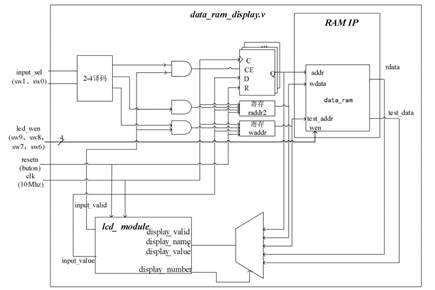
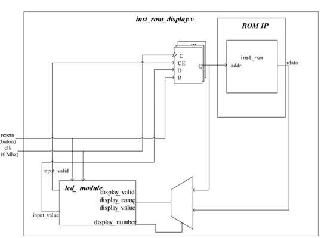
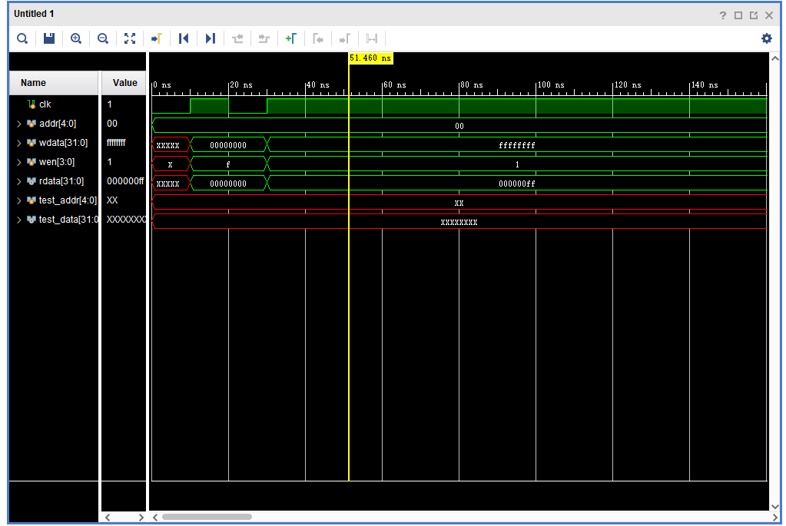
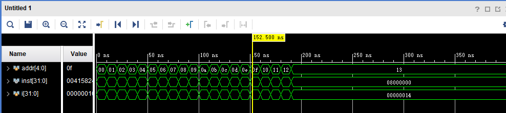

# 实验五 存储器

**姓名：王天一**

**学号：320200931301**

**时间：2022年6月12日**

## 实验目的

1. 熟悉并掌握 MIPS 计算机中存储器的原理和设计方法。

2. 熟悉并运用 verilog 语言进行电路设计。

3. 为后续设计 cpu 的实验打下基础。

## 实验设备

1. 装有 Xilinx Vivado 的计算机一台。 

2. LS-CPU-EXB-002 教学系统实验箱一套。

## 实验思路

RAM要求异步读同步写，ROM要求异步读，所谓异步读即读取数据不需要等待时钟信号即可完成，同步写即写数据需要等待时钟信号的上升沿来临才能完成。

### RAM设计图

### ROM设计图

## 输入设计

### RAM

RAM端口设计如下，与标准的RAM相比，新增读测试端口，用于调试。

clk：时钟信号（input）

wen：写使能信号（input）

addr：读写地址信号（input）

rdata：读到的数据 （output）

test_addr：用于测试的读端口（input）

test_data：测试端口读出的数据（output）

### ROM

ROM端口设计如下，ROM常用来存储指令，由于是异步读，故不需要时钟信号。

addr：读端口（input）

inst：读出的数据（即指令）（output）

## 仿真实验

异步ram

异步rom

同步的两个由于没有测试文件，没有仿真波形。

## 上板测试

异步ram

异步rom

